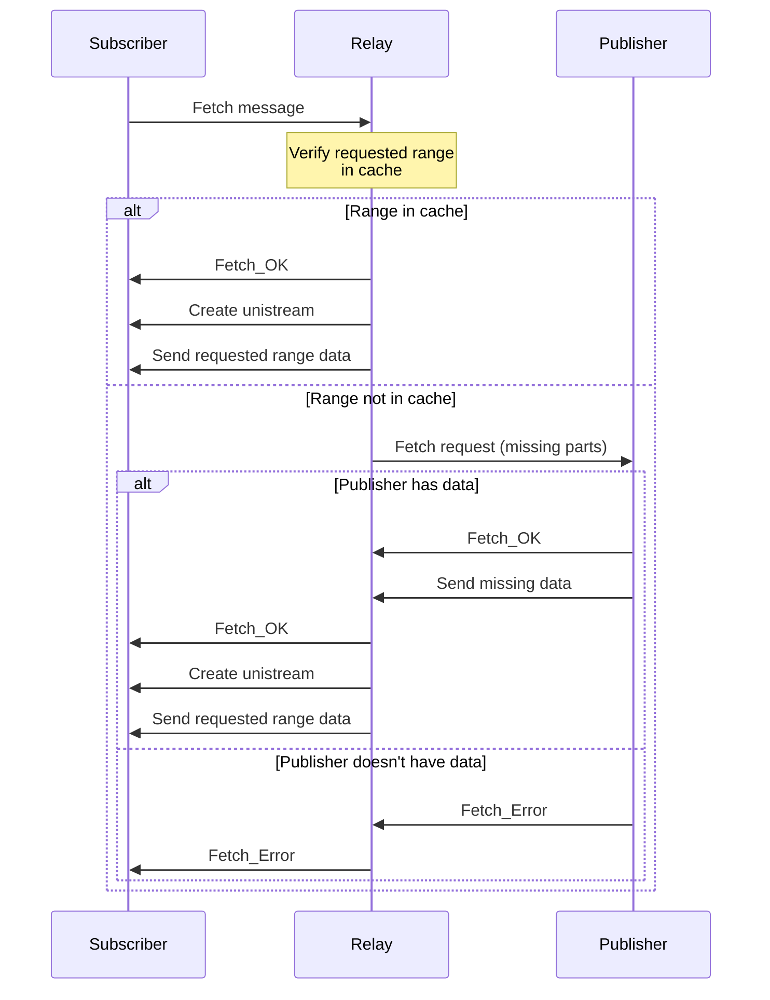

# Relay Fetch Flow

```mermaid
sequenceDiagram
    participant Sub as Subscriber
    participant Relay as Relay
    participant Pub as Publisher

    Sub->>Relay: Fetch message
    Note over Relay: Verify requested range<br/>in cache

    alt Range in cache
        Relay->>Sub: Fetch_OK
        Relay->>Sub: Create unistream
        Relay->>Sub: Send requested range data
    else Range not in cache
        Relay->>Pub: Fetch request (missing parts)
        alt Publisher has data
            Pub->>Relay: Fetch_OK
            Pub->>Relay: Send missing data
            Relay->>Sub: Fetch_OK
            Relay->>Sub: Create unistream
            Relay->>Sub: Send requested range data
        else Publisher doesn't have data
            Pub->>Relay: Fetch_Error
            Relay->>Sub: Fetch_Error
        end
    end
```
